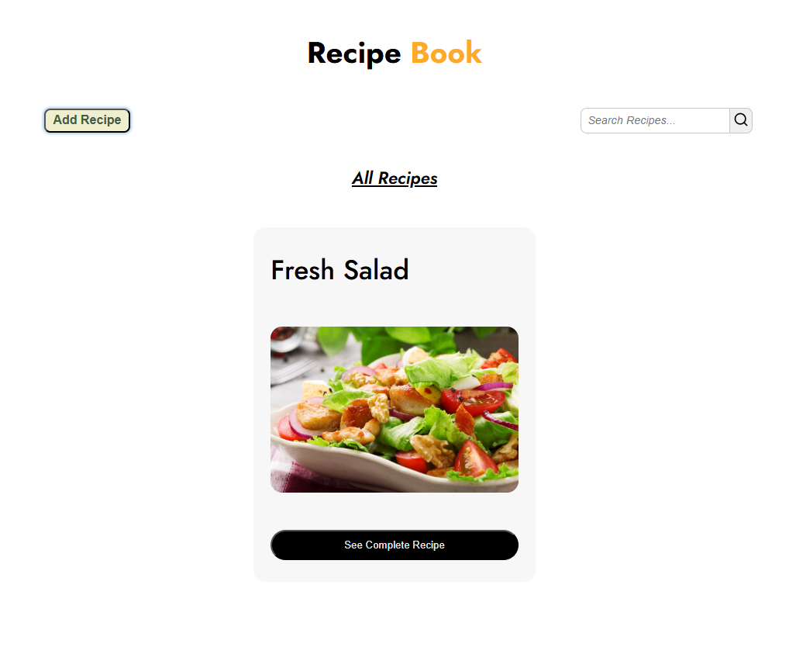

---

# Recipe Book

A simple and responsive Recipe Book web app built using **HTML, CSS, and JavaScript**.  
Users can add, view, search, and delete recipes. All data is stored in **LocalStorage**, so recipes stay saved even after refreshing the page.  

## Features
- Add new recipes with:
  - Recipe Name
  - Ingredients
  - Preparation Steps
  - Image Upload option
- Search for recipes by name
- View full recipe details
- Delete recipes
- Data persistence using LocalStorage
- Fully responsive design

## Tech Stack

- **HTML**: Structure of the application.
- **CSS**: Styling for an intuitive and minimal design.
- **JavaScript**: Handles task management and interactions.

## Deployment

This web app is deployed using [Vercel](https://vercel.com/) by Tiger. You can access the live version here: [Recipe Book](https://recipe-book-ochre-two.vercel.app/)

## Screenshots

## Getting Started

To run the app locally:

1. Clone this repository.
2. Navigate to the project folder.
3. Open `index.html` in your browser.

## License

This project is licensed under the MIT License - see the [LICENSE](LICENSE) file for details.

## Author

Made with ❤️ by Tiger

---